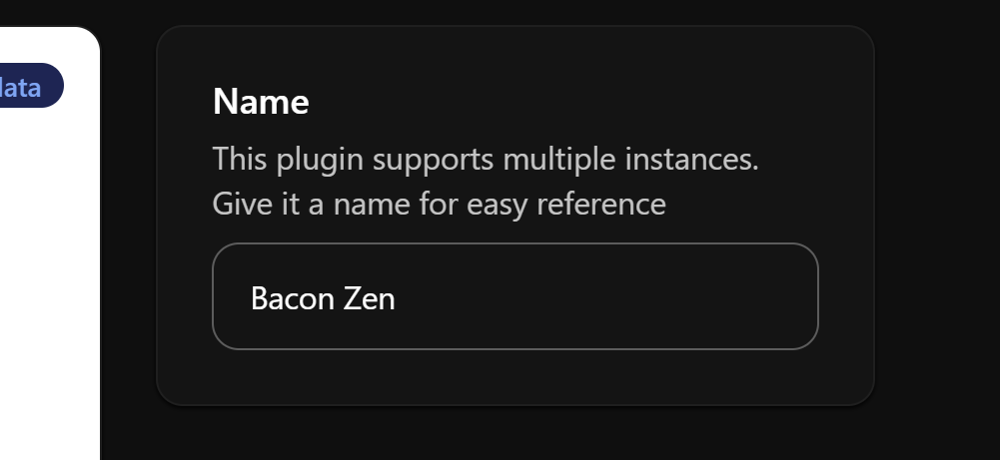
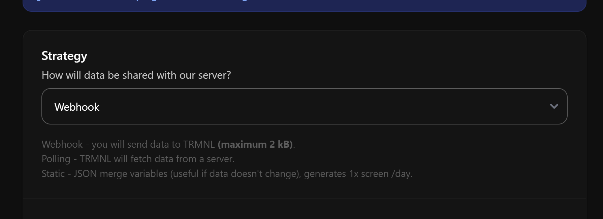
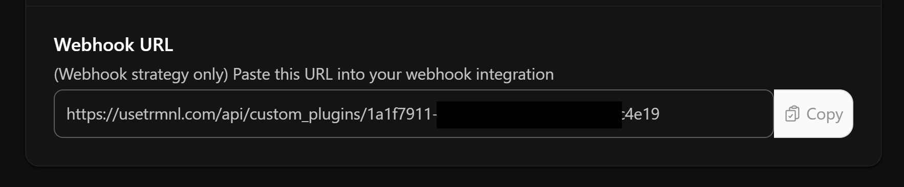
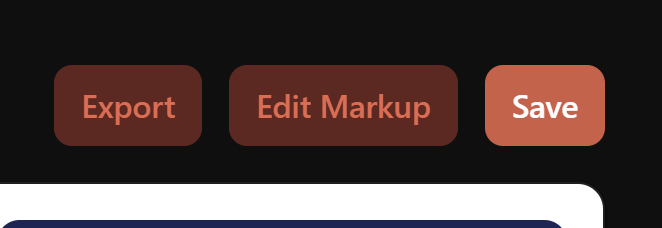
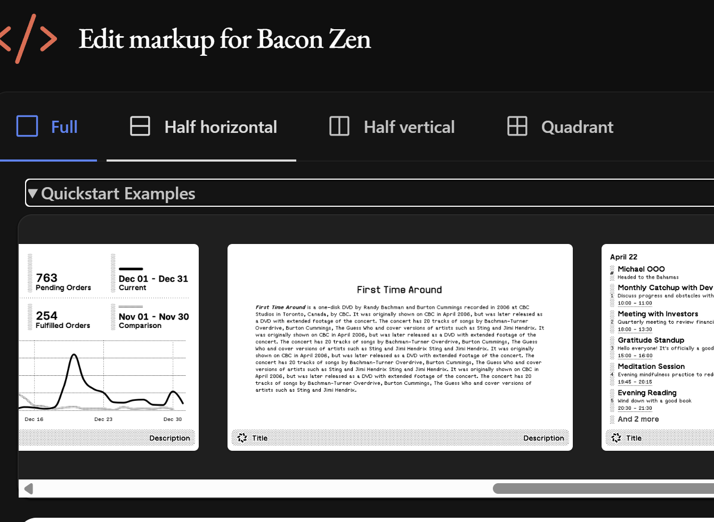
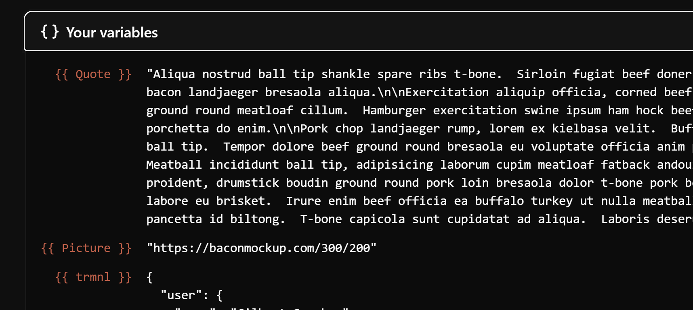
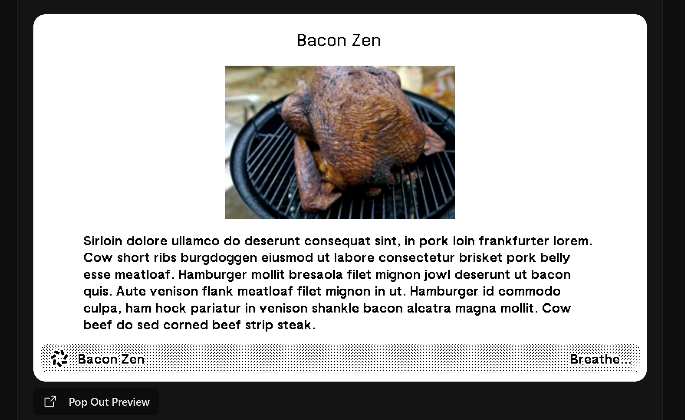
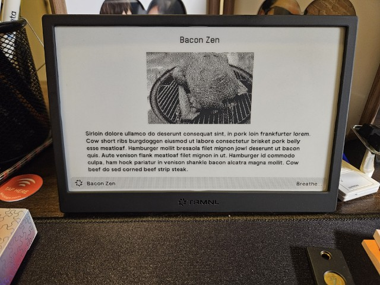

"I need another monitor" I whisper to myself again... But the "3 monitor curse"
always came to mind. That's a longer story for another time. I thought about the
problem and what I really needed was something to show me dashboards, remind me
of upcoming events, etc. That's when I saw
[Snazzy Labs video about TRMNL](https://www.youtube.com/watch?v=eIcZZX10pa4).
It's funny because I've been trying to figure out how to turn my old kindle into
an e-ink display. Just made sense for low fidelity stats and low power.

I think the TRMNL business model is really interesting and I love their open
source support. You can build your own device and even use your own server.

Creating your own plugin just takes a few clicks and they support polling for
data or using a webhook. Polling is great if you have one end point that has all
the data you're looking for. But what about when you have disparate data? Or
maybe polling the data would be problematic. That's where leveraging the webhook
can come into play.

You know what's good at massaging data and hitting REST end points? PowerShell!
This felt like a no-brainer to me.

## Overview

So before we dive into building our own plugin, let's quickly cover a few key
concepts.

<div style="background-color:white; padding: 20px">

sequenceDiagram
    Device-->>Device: Switch Between Views (5m configurable)
    Device->>+TRMNLServer: Update (15m by default)
    TRMNLServer-->>TRMNLServer: Fetch data for polling plugins (different intervals)
    Pwsh->>TRMNLServer: Invoke-RestMethod Post

</div>

You have your physical device which talks to the TRMNL servers (unless you
[brought your own server](https://usetrmnl.com/blog/introducing-byos)). Each of
the screens on the TRMNL device are plugins (or mashups of plugins). Plugins
typically poll (i.e. regularly request) an endpoint for the data they're
showing. They also support creating your own plugins that can work with either
polling, webhooks, or static data.

## Custom Plugins

The TRMNL site allows you to easily create your own plugins. They have a
phenomenal [design system](https://usetrmnl.com/framework) that let's you write
some very basic HTML and get back a nice dashboard.

Polling is ideal when:

- The endpoint is available on the web.
- Has easy to use authentication model.
- Has all the data on a single endpoint.

Webook is ideal when:

- You need to compile/massage the data into the format you want.
- You have multiple endpoints.
- Your auth isn't as straightforward as an HTTP GET.

Static is ideal when:

- Your data doesn't change.

An excellent first step is thinking about what kind of data you want to show,
and how you want it to look. You can start with one of their quickstart examples
and start modifying it to get you your desired look.

## Webhooks & PowerShell

When you create a webhook plugin you are given a URL to post your data to.
Sending JSON data is a very common thing to do with PowerShell.

```powershell
# Build your hashtable to store
$body = @{
  merge_variables = @{
    # All of these items will be available in your plugin
    Quote = $quote
  }
}
$invokeRestMethodSplat = @{
  Method      = 'POST'
  Uri         = 'https://usetrmnl.com/api/custom_plugins/GUID_HERE'
  Body        = $body | ConvertTo-Json -Depth 5
  ContentType = 'application/json'
}
Invoke-RestMethod @invokeRestMethodSplat

```

You'll want to schedule it with your scheduler of choice (e.g., task scheduler,
cron, etc.). You also will want/need to limit how often you send that data. If
you send it too often you'll get a 429 HTTP code.

## Putting it All Together

I need a dashboard that shows me some text and maybe a photo. Of what? Bacon.

Let's start with making the plugin.

1. Create a new [Private Plugin](https://usetrmnl.com/plugin_settings?keyname=private_plugin)
2. Configure your new plugin.
   1. Name your plugin.
      - 
   2. Set your "Strategy" to "Polling"
      - 
   3. That's it!
3. Save it and then you'll get a webhook url.
4. You'll then want to copy the "Webhook URL".
   - 

Next we'll write a script so that we can send info to the webhook.

```powershell
#region Do a bunch of work to get data
$invokeRestMethodSplat = @{
  Method      = 'GET'
  Uri         = "https://baconipsum.com/api/?type=meat-and-filler&paras=5&format=text"
  Body        = $body | ConvertTo-Json -Depth 5
  ContentType = 'application/json'
}
$quote = Invoke-RestMethod @invokeRestMethodSplat
#endregion Do a bunch of work to get data

# Build your hashtable to store
$body = @{
  merge_variables = @{
    Picture = "https://baconmockup.com/300/200"
    Quote = $quote
  }
}
$invokeRestMethodSplat = @{
  Method      = 'POST'
  Uri         = 'https://usetrmnl.com/api/custom_plugins/1a1f7911-3259-45c2-a16f-4101370c4e19'
  Body        = $body | ConvertTo-Json -Depth 5
  ContentType = 'application/json'
}
Invoke-RestMethod @invokeRestMethodSplat
```

Feel free to run it once so that there is data available when you're building
the markup view.

On the private plugin page you'll want to click on "Edit Markup".


I decided to use one of the examples with a nice large text section.


If you scroll to the bottom, you can see what variables you have. You should see
your data. For my code, I should have a nice bacon quote and URL for an image.


I update the text to use my reference by putting `{{ Quote }}`. I then do a
quick lookup in the design system for showing
[images](https://usetrmnl.com/framework/image). So I add
``. Save that...

And now!


Make sure to add it to your playlist!


And now you can find your zen...

## Tips

1. Arrays are an excellent way to track lists, but hashtables work even better!
   - [Handling Lists](https://help.usetrmnl.com/en/articles/10671186-liquid-101#h_36fa49cde9)
2. Limit how often you send your data to avoid 429 HTTP codes.
3. The "Liquid" templating language has a lot of useful functions and filters.
