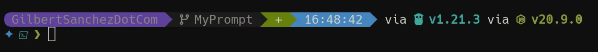

In this post I'll be go over my current prompt of choice: Starship. This is part of my [Terminals, Shells, and Prompts]() series. Starship is
a cross platform prompt written in rust. It's extremely fast, easy to extend,
and not to mention it's easy on the eyes. I use Starship on many OS's but in
this post I'll focus on PowerShell because there are a few neat tricks. If you haven't already, check out [my WezTerm setup]() to see how I configure my terminal.

You can see the latest copy of my config files here: 
[HeyItsGilbert/dotfiles](https://github.com/HeyItsGilbert/dotfiles)

## My goals

These are my overall goals with my particular setup.

1. Configs that I can sync between computers of any OS.
2. Allow flexibility to add machine/environment specific options (e.g. work).
3. Allow ability to swap any component when I see the next new shiny thing.

## Initializing

Starship includes PowerShell instructions on it's walk through guide (which is a
good sign of support in my opinion). It's as simple as the following:

```powershell
Invoke-Expression (&starship init powershell)
```

Under the hood, starship is overwriting the prompt function. If you read the
[My Shell: PowerShell](), you may recall how I
load starship in combination with initializing my profile.

```powershell
if (Get-Command 'starship' -ErrorAction SilentlyContinue) {
  function Invoke-Starship-PreCommand {
    if ($global:profile_initialized -ne $true) {
      $global:profile_initialized = $true
      Initialize-Profile
    }
  }
  Invoke-Expression (&starship init powershell)
}
```

This checks if starship is available and initializes it. But what's that
pre-command? It runs before the starship prompt renders. This is how I can make
sure all my stuff is initialized.

## Configuration

Configuration is all done in a single `starship.toml` file.



### Prompt Layout

I was a long time user of powerline, and I created something similar. Starship
is able to print unicode characters.

```toml
format = """
[\uE0B6](fg:purple)[$directory](bg:purple)\
[\uE0B0](fg:purple bg:bright-black)$git_branch\
[\uE0B0](fg:bright-black bg:green)$git_status\
[\uE0B0](fg:green bg:12)$time\
[\uE0B0](fg:12 bg:none) $all $character\
"""
add_newline = true
```

That prompt looks great... until you scroll up and your whole terminal is wall-to-wall powerline glyphs. What if your prompt could clean up after itself?

## Transient Prompt

Transient prompt allows you to change your prompt after you execute your
command. This can be useful if you'd prefer a simpler prompt in your scrollback
and only keep the relevant info on your current prompt. The example given on the
site replaces the prompt with just the character.

Read more: [TransientPrompt in PowerShell](https://starship.rs/advanced-config/#transientprompt-in-powershell)

### Pro-Tip: Prompt Profiles

I only just discovered this! The `starship prompt` command supports a `--profile`
flag. You can use this to tweak your prompt in a given context (which PowerShell)
is great a determining. But you can mix this with the transient prompt, and you
can print a short prompt.

I wanted something that would print the directory and the time. So I created the
following profile:

```toml
[profiles]
short = """
[\uE0B6](fg:purple)[$directory](bg:purple)\
[\uE0B0](fg:purple bg:12)$time\
[\uE0B0](fg:12 bg:none) $character
"""
```

This profiles trick pairs nicely with a well-structured [PowerShell profile]() — you can dynamically pick which Starship profile to render based on your session context.

## Pro-Tip: EngineEvent `PowerShell.OnIdle`

Recently on the PowerShell discord someone was asking about how they could
continually update their prompt. Super Genius Jaykul recommended using the
EngineEvent system to execute commands and gave this command.

Since my prompt is two lines long we need to remove the last two lines and go
back the beginning.

```powershell
Register-EngineEvent -SourceIdentifier PowerShell.OnIdle {
  Write-Host "$([char]27)[2A$([char]27)[0G$(prompt)" -NoNewline
}
```

So let's dissect this what we're writing. I'll break each bit into it's own line
and add a comment explaining what it does.

```powershell
$([char]27) # Escape Sequence
        [2A # Cursor Control: Move N lines up (2 in this case)
$([char]27) # Escape Sequence
        [0G # Cursor Control: Move to column N (0 in this case)
  $(prompt) # Print the prompt function again.
```

Why not \`e? While that's valid, it doesn't work in Windows PowerShell. To work
for both, we can use `[char]27`.

---

In the past few posts in the series I've briefly touched on some ANSI escape
codes (see [Escape Codes]()), and in my next post I'll be going into more depth. There is so much to
cover but I'll be hitting a few highlights and pointing to a ton of references.

How's the technology from 1979 still shaping our daily life? Stay tuned and
find out!

## References

- [Starship](https://starship.rs/): Cross-shell prompt.
- [Powerline](https://github.com/powerline/powerline): Original powerline.
- [about_special_characters](https://learn.microsoft.com/en-us/powershell/module/microsoft.powershell.core/about/about_special_characters?view=powershell-7.3#escape-e): Escape character in PowerShell (not Windows PowerShell)
