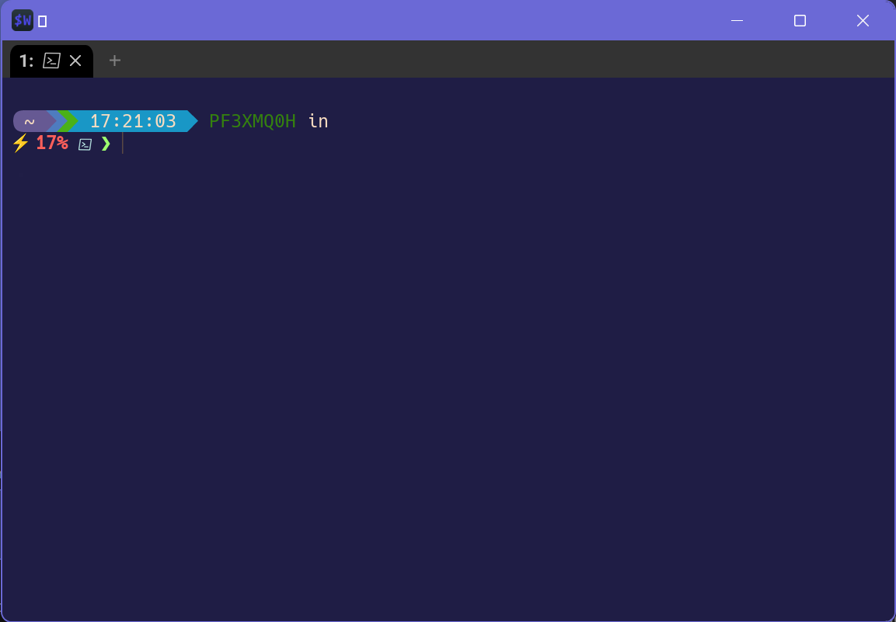

This is the second post in this series. You can see the first post explaining
[Terminals, Shells & Prompts](). In
this post I'll be covering my specific settings.

You can see the latest copy of my config files here: 
[HeyItsGilbert/dotfiles](https://github.com/HeyItsGilbert/dotfiles)

## My goals

1. Configs that I can sync between computers of any OS.
2. Allow flexibility to add machine/environment specific options (e.g. work).
3. Allow ability to swap any component when I see the next new shiny thing.

## WezTerm: Cross Platform & Flexible

[WezTerm](https://wezfurlong.org/wezterm/) was written by Wez Furlong. He's a
former Meta employee and created tools like Watchman and EdenFS. Hands down one
of the smartest and humblest engineers I've had the privelege of interacting
with. If you're looking for a mentor, Wez offers mentoring at his
[patreon](https://www.patreon.com/WezFurlong).

WezTerm is written in Rust which is gaining popularity lately. It's configuration
is based in LUA which unlocks a ton of possibilitie. It's use of a single config
file helps me meet all three of [my goals](#my-goals).

If you haven't read the Quick Start for the config, I would recommend starting
there. [WezTerm Configuration Quick Start](https://wezfurlong.org/wezterm/config/files.html#quick-start)

## My WezTerm Config

You can see the latest copy of my config files here: 
[HeyItsGilbert/dotfiles](https://github.com/HeyItsGilbert/dotfiles)

The WezTerm config is stored in `.wezterm.lua` which I put in my home directory.

It starts with some initial imports and variables.

```lua
-- The only required line is this one.
local wezterm = require 'wezterm'
local mux = wezterm.mux
local act = wezterm.action
-- Some empty tables for later use
local config = {}
local keys = {}
local mouse_bindings = {}
local launch_menu = {}
```

This is where I try to import a module called "work". The goal is to deploy the
work module through another internal process but still allow me to use the same
config. I'll go over how I leverage that later.

```lua
local haswork,work = pcall(require,"work")
```

## LUA Logic: OS Checking

Now I start to check what OS I'm on. This is the power of LUA. It offers the
ability to add logic checks or executions.

```lua
if wezterm.target_triple == 'x86_64-pc-windows-msvc' then
  --- Grab the ver info for later use.
  local success, stdout, stderr = wezterm.run_child_process { 'cmd.exe', 'ver' }
  local major, minor, build, rev = stdout:match("Version ([0-9]+)%.([0-9]+)%.([0-9]+)%.([0-9]+)")
  local is_windows_11 = tonumber(build) >= 22000
```

I check if I'm on Windows and then once I know I'm on Windows, I call out to
`ver` because it's extremely fast. With some regex I can parse our the Major,
Minor, Build, and Revision number. Windows 11 is Major version 11 right? Nope.
It's actually Build numbers higher then 22000. With that, I can make a local
bool variable called `is_windows_11`. I was planning on using this for some
themeing, but opted against it. Could be useful later...

## 🎶 Here Comes Your Shell 🎶: PowerShell

On Windows the default shell is `cmd`. That's gotta change... So I set
PowerShell Core as the `default_prog`. Then I insert two options into the
[Launcher Menu](https://wezfurlong.org/wezterm/config/launch.html#the-launcher-menu),
one for Windows PowerShell and another for PowerShell Core.

```lua
--- Set Pwsh as the default on Windows
config.default_prog = { 'pwsh.exe', '-NoLogo' }

table.insert(launch_menu, {
  label = 'PowerShell',
  args = { 'powershell.exe', '-NoLogo' },
})
table.insert(launch_menu, {
  label = 'Pwsh',
  args = { 'pwsh.exe', '-NoLogo' },
})
```

On non Windows I don't set the default program, I just add PowerShell to the
Launcher Menu.

```lua
table.insert(launch_menu, {
  label = 'Pwsh',
  args = { '/usr/local/bin/pwsh', '-NoLogo' },
})
```

In the next post I'll be going over my PowerShell profile.

## Conflicting Keyboard Shortcuts

I love PSReadLine! Once the ability to highlight or jump words was added, I was
never gonna look back. But here's the first bump. That same shortcut (Ctrl +
Shift + Left/Right) is used by WezTerm for moving panes.

This portion of the config is long and I'll spare you the scrolling. At a high
level, I created a new table called `keys` and added the standard set of
shortcuts. Then I commented out the conflicting shortcuts.

## Selecting Shell Output

By integrating `OSC 133` (see [Escape Codes]()) into my PowerShell prompt I'm able to tell WezTerm where
my output is. This mouse binding allows me to triple click on my output to
select it.

```lua
mouse_bindings = {
  {
    event = { Down = { streak = 3, button = 'Left' } },
    action = wezterm.action.SelectTextAtMouseCursor 'SemanticZone',
    mods = 'NONE',
  },
}
```

See more at
[WezTerm Shell Integration](https://wezfurlong.org/wezterm/shell-integration.html).

## Setting my Options

Now that I have a bunch of tables set up, I can start to set my config variable.

```lua
--- Default config settings
config.color_scheme = 'AdventureTime'
config.font = wezterm.font('Hack Nerd Font')
config.font_size = 10
config.launch_menu = launch_menu
config.default_cursor_style = 'BlinkingBar'
config.disable_default_key_bindings = true
config.keys = keys
config.mouse_bindings = mouse_bindings
```

You can see the `color_scheme` here. I've slowly started to shift from Solarized
to more purple based themes (see this website!).



## Work Overrides

My work module has a function called `apply_to_config`. I can append things to
my launcher, etc.

```lua
-- Allow overwriting for work stuff
if haswork then
  work.apply_to_config(config)
end
```

See more at [Making Your Own LUA Modules](https://wezfurlong.org/wezterm/config/files.html#making-your-own-lua-modules)

## Finally

The last thing to do is to return the config file.

```lua
return config
```

---

Hopefully you found something useful for your config. In the next post I'll be
going over the PowerShell Profile.
