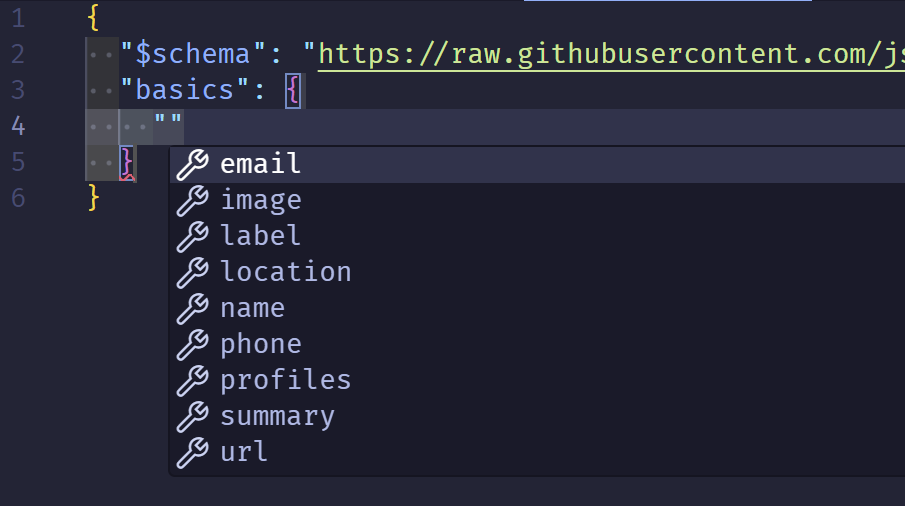

A while ago I was applying for a new role and I had given my LinkedIn profile.
The recruiter said that the team was interested in meeting, and she said the
thing I was dreading... "Can you send me a copy of your resume?"

<iframe src="https://giphy.com/embed/QajHhLKW3VRcs" width="480" height="317"
style="" frameBorder="0" class="giphy-embed" allowFullScreen></iframe><p><a
href="https://giphy.com/gifs/QajHhLKW3VRcs">via GIPHY</a></p>

See the last time I worked on my resume it was on... Apple Pages
:man_facepalming: Maybe you wrote yours in Word, and now you don't have access to it. Or it
renders weird in the new version. Have you edited it lately? Messing with weird tables and odd formatting. The bullet points are different font sizes and it just looks sloppy.

So how do you avoid this ecosystem lock in? Use Json!

By the end of this you'll learn about JSON Resume:

1. Learn how to use the JSON Resume schema.
2. See and configure the different hosting options.
3. Style your resume by exploring the different themes.
4. Be able to quickly create your resume on Netlify.


Just want to get it done?

1. Clone my [resume repository](https://github.com/HeyItsGilbert/resume)
2. Update the `resume.json` with your info.
3. Setup netlify to build your new clone with `yarn build`.


## JSON Resume to the Rescue

> JSON Resume is a community driven open source initiative to create JSON-based standard for resumes. - <https://jsonresume.org/>

JSON Resume allows your to codify the data of your resume into JSON. It offers a
simple schema to easy add/remove/update your resume over time.

You can see an example of complete resume at on the [Schema](https://jsonresume.org/schema) page.

The one thing i would suggest is adding the schema to top of your JSON:

```json
{
    "$schema": "https://raw.githubusercontent.com/jsonresume/resume-schema/v1.0.0/schema.json",
}
```

If your editor supports it, which VSCode does, you'll now get IntelliSense support for adding info.



## Install It

Once you have your resume json ready you can start to build it with `resumed` which is an NPM package.


If you haven't used Node or npm, I would suggest reading one of the many guides on installing it and configuring it.


You will need to install it and find and install the theme you want. To see all
the possible themes check out this
[jsonresume-theme search](https://www.npmjs.com/search?q=jsonresume-theme). I personally like the `jsonresume-theme-elegant` theme.

```shell
npm install resumed jsonresume-theme-elegant
```

## Build It

Once it's installed you'll want to build your resume with the command: `resumed render`. This should create a `resume.html` page!

Rinse and repeat as you make changes.

## Serve It

You have a few options to share this.

1. Post your `resume.json` as a gist and it'll automatically show up.
2. Use a static site hosting service where you can build your resume, just like you just did.

### Gist

The gist is the easiest way to share your resume.

1. Go to <https://gist.github.com/>
2. Create a new gist called `resume.json`
3. Paste in your json.
4. You can then go to [registry.jsonresume.org/heyitsgilbert](https://registry.jsonresume.org/thomasdavis) where you replace `heyitsgilbert` with your github username.

### Netlify

This is my preferred way because it allows me to easily build my static content and serve it under my personal resume.

1. Make a GitHub repository to host your resume, and few other files.
   1. You can make this easy by cloning my [resume repository](https://github.com/HeyItsGilbert/resume) and updating the `resume.json`
2. Create an account or sign in on Netlify.
3. Grant access to your new resume repository.
4. Then you have to configure your build.

Quick note about my repository. I have a public folder with a `.gitkeep` file in
it so the directory always exists. In my `packages.json` build step I copy the `resume.html` to
`public\index.html`.

On Netlify you typically have to tell it what your build steps. Since the `packages.json` file has my build step defined, I tell it use that via `yarn build`.

Here are my "Build Settings"

- Runtime: Not set
- Base directory: /
- Package directory: Not set
- Build command: `yarn build`
- Publish directory: public
- Functions directory: netlify/functions

So the only real "magic" is telling it to run the build step.
