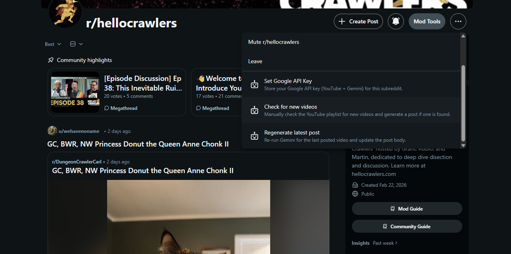
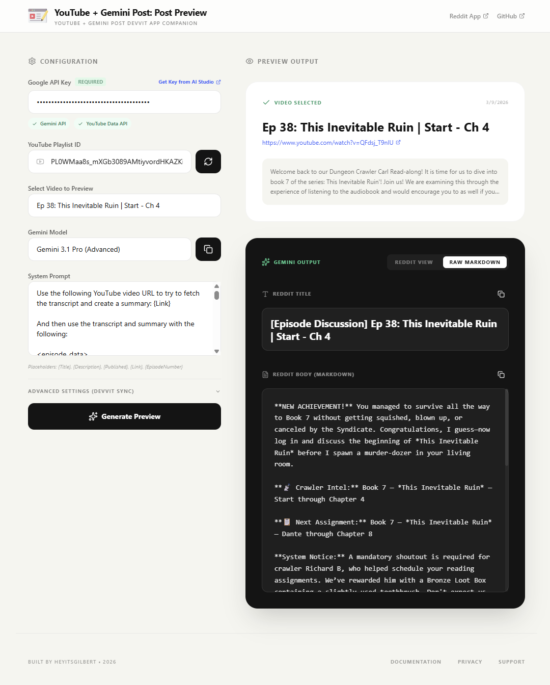

I have a confession: I became a moderator for a subreddit and immediately
started building tools instead of, you know, moderating 😬.


**NEW ACHIEVEMENT!!! "Distracted Moderator"**

You have been granted mod privileges for a subreddit.
You have chosen to write code instead!

Reward: "Technical Debt" +1 Wisdom, -1 Charisma


In my defense, my internal System AI made me do it (see ADHD posts).

If you're a fan of the Dungeon Crawler Carl series, the audiobook that the
[Hello Crawlers podcast](https://hellocrawlers.com) covers, you know The System
AI. It's the omnipresent AI that drops people into a deadly dungeon and hands
them just enough tools to survive, but never quite what they asked for. You work
with what you've got or you die.

## The "PipeDream"

When the Hello Crawlers team asked for mod volunteers, I immediately offered to
help. I'm a long time patron and a genuine fan, so it felt like a natural fit.
But almost immediately I spotted something I wanted to fix: posting YouTube
videos to the subreddit was manual, inconsistent, and kind of tedious.

I had a vision. A beautiful, elaborate workflow. Claude-powered summaries,
automatic posts, the whole thing. I built it in Pipedream, but I realized
that maybe I should see what this new Devvit thing is. Also, I don't want
it to just live somewhere that only I can mess with. So I pivoted, and I took
my high level workflow, YouTube > Claude > Reddit Post, and shifted to Devvit.

Then I actually looked at what
[Devvit](https://developers.reddit.com/docs/devvit) allowed.

Devvit - Reddit's platform for building apps and mod tools - has restrictions on
which web endpoints you can call. They did have some pre-approved endpoints but
my original workflow hit a wall almost immediately. Claude wasn't on the allowed
list and I didn't feel like waiting for an approval.

## B-B-B-Boss Battle!


**B-B-B-BOSS BATTLE!**
The garden is walled off! Your preferred weapon has been removed from your inventory!


Here's the thing about constraints: you can fight them or you can get curious
about them. I like to get curious.

Digging through the allowed endpoints, I found Gemini was available by default.
I hadn't planned on using Gemini. But I also had a hard requirement that this
tool needed to be free - the guys were already delegating work to me, the
last thing I wanted was to hand them a monthly bill along with a new tool to
learn.

Gemini's free tier is generous. Genuinely, surprisingly generous.

Constraint solved. And honestly? The end result was better than my original plan.

## What It Actually Does

Just posting YouTube links is boring and doesn't engage the community. The
[YouTube + Gemini Post Devvit App]
lets moderators set a
YouTube playlist to watch, supply an API key and generate dynamic
content - using a prompt they control themselves.

That last part matters. I didn't want to hardcode the AI behavior. Users of the app
will know their audience better than I do. Giving them a prompt they can
tweak means they're not dependent on me to change how the output feels. Even if
I'm _"accelerated"_ from the project , they can keep adjusting it without touching any
code.

I think of it as a no-code control panel for the AI layer.

This was great! But I realized that I needed a way to test the prompts without
re-creating the same post over and over.

So I also created a [companion web app] for testing output before
anything goes live on the subreddit. It let's you try different models
and verifies that your API key has the right access. If it doesn't have the
right access, you get linked to the exact place to add it.


Did I mention that both API's are free?


The app actually started as an AI Studio experiment. I prototyped the whole thing
there first, but when it came time to publish they were having technical
issues... So I just threw it on Netlify. Took about ten minutes.

## Devvit Was Easier Than I Expected

If you've deployed something to Netlify or Vercel, you already understand the
mental model. Devvit clicked for me pretty fast once I stopped overthinking it
and realized they're essentially single page apps hosted by Reddit.

The [Devvit Discord] helped a lot. The community is genuinely welcoming and the
people there know their stuff. A special shoutout to `u/Beach-Brews` who not
only helped me work through a problem but actually filed a bug on my behalf when
we discovered that the Devvit link type supported a body field - something that
wasn't obvious from the docs.

That kind of help makes open source feel worth it.

## Go Build Something


**NEW ACHIEVEMENT: "Free... As In Beer!"**

You have shipped a thing! It is free! It is open source!
Nobody had to learn a new tool.

Reward: Platinum "Your AI Bill is Due" Loot Box


The app is free, open source, and lives on the [Reddit app directory]. The
[source is on GitHub] if you want to poke around or contribute. Share it with
your favorite podcast or YouTuber.

And if you haven't spent time in [AI Studio](https://aistudio.google.com/) yet,
this project was my first real excuse to dig in. It's a great sandbox. Go break
something.

Finally - if you're not already listening to Hello Crawlers, fix that!
https://www.hellocrawlers.com/

---

Special thanks to Grant from the Podcast who was my ~~guinea pig~~ test Mordecai!

[Devvit Discord]: https://developers.reddit.com/discord
[Reddit app directory]: https://developers.reddit.com/apps/youtube-gemini
[YouTube + Gemini Post Devvit App]: https://developers.reddit.com/apps/youtube-gemini
[companion web app]: https://youtubegeminipostdevvit.netlify.app/
[source is on GitHub]: https://github.com/heyItsGilbert/youTubeGeminiPostDevvit/