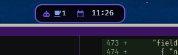

Everyone's talking about what AI can do and whether it's good or bad. But nobody's
talking about what it costs and where the gains actually go (hint: I'm not talking
about dollars). This isn't a case against AI. It's practical advice from someone
who is leaning heavily into using it every day.

Maybe you've kicked off a few agents, tried some different harnesses, and
subscribed to a few YouTubers. Now you're shipping faster than ever before.
You've drunk the Kool-Aid, and you're a believer. But lately you're absolutely
exhausted. You feel "fried," almost like your head has been on fire. Your eyes
are tired. What the hell is going on?

## The biological case for slowing down

Richard Cytowic makes this plain in [*Your Brain Wasn't Built to Hold This Much
Information*](https://www.youtube.com/watch?v=t0qq9R__XiQ): your brain burns ATP
for every decision, every context switch, every review pass. You have a finite
cognitive budget every day, and you're spending it whether the work feels hard
or not.

A [*Harvard Business Review* study](https://www.youtube.com/shorts/l_T__d6ACGs)
confirmed what a lot of people already felt but couldn't name: AI-assisted work
produces a specific kind of exhaustion. Not from deep focus, but from
throughput. You moved fast, you produced a lot, and somehow you're more depleted
than before. What's new? Context switching.

## All about context

No, not LLM context (which I'm sure you're becoming an expert in). Every time you
jump between tasks or check on an agent's output, you pay an ATP toll. The agent
pop-up saying "I need you to make a decision" is costing you, and you probably
don't realize it.

I felt this for years before I had the vocabulary for it. Understanding how my
brain handles flow and interruption isn't just personal experience -- it's shaped
how I structure and approach my work.

As someone with ADHD, I know that the pop-up or the small red circle above the app
is trouble. I've learned over years that "a quick check" is never just that, and
if I'm not careful I can lose hours. To make it worse, the fear of forgetting to
go back adds to the urgency. My brain says, "if you don't look at that now, you
won't remember for another hour or two." That's fine for important things, but
these pop-ups aren't that.

## The systemic trap: The vampiric effect

Steve Yegge named this in [*From IDEs to AI
Agents*](https://www.youtube.com/watch?v=aFsAOu2bgFk) as the Vampiric Effect:
the cognitive overload you start to experience as you try to keep these agents
running. There's another concerning aspect -- companies absorb every
productivity gain you produce, and that isn't always reflected back on you. The
baseline just moves up. You're not 3x more productive and compensated
accordingly -- you're just expected to produce 3x now. The HBR study
corroborates that. It happened with email and smartphones. AI is just faster,
and the extraction is harder to see. It's also slightly insidious because it
"feels easy," and you could see how some would argue that it shouldn't change
compensation.

So is the vampire the LLM, or is it the business that keeps pushing you to your
physical limits? Either way, the vampire won't kill you… It keeps you just alive
enough to keep giving.

## The wrong kind of junior

Here's a useful mental model: each agent you run is a junior engineer who wants
your attention -- but the kind that never remembers and asks you the same thing
over and over.

Now imagine you have five of them. They're all working on something, they all
have questions, and they're all waiting on you. Oh, and they're asking you right
when you're in the middle of something else. Picture sitting at your desk with
people constantly tapping on your shoulder asking for something.

That's not a productivity multiplier. That's management overhead you didn't sign
up for, and it's probably not showing up in your comp.

The people who get wrecked by this are the ones who think AI agents are like
background processes. They're not. They require steering, review, judgment calls,
and escalation handling. That's real cognitive work.


If you don't design around it, the agents run you instead of the other way around.


## What I actually do

By following my simple course for $99.99 you too can… Just kidding!

I run my agents in WezTerm, which lets me split panes and use CLI tools side by
side. For notifications, I needed something that wouldn't break my flow. I forked
my current [ZeBar](https://github.com/heyItsGilbert/quiet-velvet) theme of choice
and built an "agent-deck"-like feature. It adds a silent visual indicator at the
top of my screen that shows agent status without interrupting me. No pop-ups, no
sounds, no unwanted context switching. Just queued, on my terms.


  
  


The reason: notifications designed to interrupt get addressed immediately, even
when that's not what the moment calls for. That's an ADHD panic response
masquerading as productivity. The fix is simple -- don't let the tool set the
terms of your attention. You check when you're ready, not when the
computer/agent/harness demands it. This article is about AI, but keep that in mind
for all your tools.

This isn't just useful if you have focus challenges. It's useful for anyone trying
to do deep work. The goal is the same: protect the windows where you can actually
get into flow. That's when work is most enjoyable, and when you produce the most
value.

## Practical advice

Build tooling to fill your gaps, not to replace your judgment. Optimize for you,
not for the tools.

The goal isn't maximum agent throughput. The goal is maximizing the time you spend
on work that gets you into flow and minimizing the interruptions that pull you out.
AI should handle the mechanical, the repetitive, the first pass. You handle the
judgment, the architecture, the decisions that require context no agent has.

And watch the baseline. If your output keeps going up and nothing else does,
you're feeding the vampire. That's worth naming -- with yourself, and with whoever
sets your goals.
