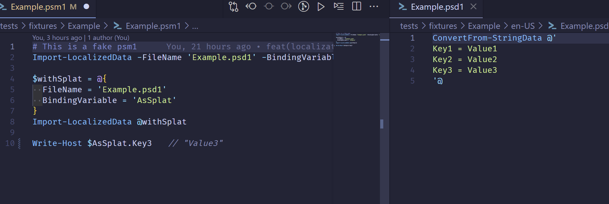

PowerShell is one of the languages that makes Localization very easy to
implement. But what is Localization (l10n)? Is that different from
Internationalization (i18n)?

⏩ [I know localization is important⏩](#localization-in-powershell)

If your primary language is English, and you haven't traveled it's
easy to forget that there's an entire globe of people who don't speak
English. Maybe you've visited a neighborhood where the primary language
is different, and can remember how disorienting that can be.

Internationalization (i18n) is the process of changing your software so that it
isn't hard coded to one language. Localization (l10n) is the ongoing effort of
adding more resource to support new languages.

Why is this so important to me? I'm a first generation Mexican American, aka
Chicano, who grew up in a home where the primary language was Spanish. I spoke
only Spanish until the age of 5, where in first grade I was placed (due to
classroom limits) into an English speaking classroom. I definitely struggled
that year, but thanks to my family my brother and I quickly transitioned. (Also
thank you video games). But I'll never forget having to leave the safety of my
friends and being placed into a class where my communication capabilities were
next to none. That experience taught me firsthand how language barriers can
isolate people - which is why I'm passionate about making PowerShell accessible
to everyone, regardless of their primary language.

## Localization in PowerShell

PowerShell luckily provides us an easy way to create a variable that contains
our text. We can simply create a PowerShell Data file (PSD1) and import it with
`Import-LocalizedData`. Let's see it in action.

In our `.\en-US\Messages.psd1`:

```powershell file=.\en-US\Messages.psd1
ConvertFrom-StringData @'
Welcome = "Welcome to the jungle!"
Goodbye = "Bye, bye, bye, lil Sebastian."
LaughError = "HAHA! Error: {0}"
'@
```

In the `.\main.ps1` script:

```powershell file=.\main.ps1
Import-LocalizedData -BindingVariable "Messages" 
Write-Host $Messages.Goodbye
```

If you run the `main.ps1` file it'll output:

```powershell
> .\main.ps1
Bye, bye, bye, lil Sebastian.
```

Great! I mean we got the expected text... but RIP lil Sebastian.


### Let's Support A New Language

The `Messages.psd1` contains the key and values of our text. To support a new
language you'll need to make the same file, but under a new folder. The folder
would match the new supported language. To support US Spanish you could create
`.\es-US\Messages.psd1`. Note that the keys stay the same, but the values
change. The file would look like:

```powershell file=.\es-US\Messages.psd1
ConvertFrom-StringData @'
Welcome = "¡Bienvenido a la jungla!"
Goodbye = "Adiós, adiós, adiós, pequeño Sebastian."
LaughError = "¡JAJA! Error: {0}"
'@
```

## VSCode PowerShell Localization

Speaking of making localization easier for users, I also want it to be easy for
developers. One challenge that I experienced was that it can be difficult to
tell what a particular localized variable says.

As part of the PS Inclusive Organization that I started with Jake Hildreth, I
decided to make an attempt at creating a VS Code extension. I was able to create
the [PowerShell Localization] extension which allows you to see values decorated
inline.



You can install the extension to make it easier to see what your code would
output.

## Community Support

So we've created 2 language files to support `en-US` (US English) and `es-US`
(US Spanish), but what about all the other languages? This is where a community
supporting program like [Crowdin] can be immensely helpful. While there are
obvious paid features, for open source software you can actually create a free
project.

For end users who would like to contribute, they would submit their suggestions
on the project portal. This could go through review and then sync to your
codebase. You can see an example of that portal at
[Psake translation project on Crowdin].

There are several approaches to syncing changes from Crowdin, but I'm a fan of
the GitHub Integration. You can define the English source, and where the
outputted files would be called and where to place them.

### Localizations as PSD1 vs YML

The PowerShell Data format has some limitations that can make it difficult to
use. The PSD1 format is not a format supported by Crowdin. Inside of the psd1
files, we're limited to a certain set of functions. For example,
`ConvertFrom-JSON` is not available. `ConvertFrom-StringData` is the most common
to use.

YAML is another file type supported in Crowdin. It can be read without modifying
the keys (which other formats do) making it an ideal format to use as a source.

Thanks to the `powershell-yaml` module we can `ConvertFrom-Yaml` and use our
PowerShell knowledge to generate our desired formats.

## Psake: An Example

For the Psake project I decided that it would be easier to generate the PSD1's
as part of the build process and to start with yml files. Using the psd1 file
would mean that Crowdin wouldn't be able to read it automatically and I wanted
this to be as easy for contributors and maintainers as possible.

### Overall Process


graph TD
    A["/l10n/en-US.yml<br/>(Source File)"] --> B["Build Script<br/>(Process l10n folder)"]
    
    %% Other l10n files
    C["/l10n/es-ES.yml"] --> B
    D["/l10n/fr-FR.yml"] --> B
    E["/l10n/de-DE.yml"] --> B
    F["...other l10n files"] --> B
    
    %% Build script outputs
    B --> G["src/en-US/Messages.psd1"]
    B --> H["src/es-ES/Messages.psd1"] 
    B --> I["src/fr-FR/Messages.psd1"]
    B --> J["src/de-DE/Messages.psd1"]
    B --> K["...other culture folders"]
    
    %% Git sync to Crowdin
    A --> L["Git Sync to Crowdin"]
    L --> M["Crowdin Project<br/>(en-US as source)"]
    
    %% Crowdin creates/updates translations
    M --> N["Crowdin creates/updates:<br/>- es-ES.yml<br/>- fr-FR.yml<br/>- de-DE.yml<br/>- ...other cultures"]
    
    %% Sync back to repo
    N --> O["Sync back to repo<br/>(Update l10n files)"]
    O --> C
    O --> D
    O --> E
    O --> F
    
    %% Styling
    classDef sourceFile fill:#e1f5fe,stroke:#0277bd,stroke-width:2px
    classDef buildScript fill:#f3e5f5,stroke:#7b1fa2,stroke-width:2px
    classDef outputFiles fill:#e8f5e8,stroke:#388e3c,stroke-width:2px
    classDef crowdinProcess fill:#fff3e0,stroke:#f57c00,stroke-width:2px
    
    class A sourceFile
    class B buildScript
    class G,H,I,J,K outputFiles
    class L,M,N,O crowdinProcess


1. **Source File**: `/l10n/en-US.yml` serves as the primary source for all
   localization strings

   ```yaml
    en-US:
     error_invalid_task_name: "Task name should not be null or empty string."
     ...
   ```

2. **Build Process**: A build script reads all YAML files in the `/l10n/`
   directory
3. **Output Generation**: For each language file, creates corresponding
   PowerShell data files in `src/{culture}/Messages.psd1`
4. **Crowdin Integration**:
   - Git sync pushes the source file (`en-US.yml`) to Crowdin
   - Crowdin uses this as the source for translation
   - Translators work on other language versions
   - Completed translations sync back to the repository as new/updated YAML
     files
5. **Continuous Loop**: Updated translations trigger the build process again,
   creating fresh PowerShell message files

This creates a complete localization pipeline where:

- Developers maintain the English source
- Build automation handles PowerShell file generation
- Crowdin manages the translation workflow
- The process repeats as translations are updated

### Crowdin Configuration

Our `crowdin.yml` file contains the following which automatically determines the
filename.

```yml file:crowdin.yml
"files": [
  {
    "source": "/l10n/en-US.yml",
    "translation": "/l10n/%locale%.yml"
  },
]
```

### Generating PSD1's from YAML

Here's the complete build script that handles the YAML-to-PSD1 conversion:

```powershell
$src = Join-Path $PSScriptRoot -ChildPath 'src'
# First we gather all the language files
$languages = Get-ChildItem -Path "$PSScriptRoot\l10n" -Filter '*.yml' -File

foreach ($lang in $languages) {
    # Using powershell-yaml module we can convert the yaml to a PSObject
    $yaml = Get-Content -Path $lang.FullName -Raw | ConvertFrom-Yaml

    # The first (and only key at the very top level is the locale name. e.g. en-US)
    foreach ($locale in $yaml.Keys) {
        Write-Verbose "Processing locale: $locale"
        $localeDir = Join-Path -Path $src -ChildPath $locale
        if (-not (Test-Path -Path $localeDir)) {
            New-Item -Path $localeDir -ItemType Directory > $null
        }

        $psd1 = Join-Path -Path $localeDir -ChildPath "Messages.psd1"
        $content = [System.Text.StringBuilder]::new()
        
        # Write a warning message to let folks know not to modify them by hand.
        $warningMessage = "# This file is auto-generated from YAML localization files. Do not edit manually."
        [void]$content.AppendLine($warningMessage)
        [void]$content.AppendLine("ConvertFrom-StringData @'")
        
        # Under the root key we have each of the keys we want in the PSD1
        foreach ($key in $yaml[$locale].Keys) {
            Write-Verbose "Processing key: $key"
            # We don't need to worry about escaping here, as the keys are simple strings
            # and the values are already escaped by ConvertFrom-Yaml
            $value = $yaml[$locale][$key]
            [void]$content.AppendLine("    $key=$value")
        }
        [void]$content.AppendLine("'@")
        Write-Verbose "Writing to $psd1"
        Set-Content -Path $psd1 -Encoding UTF8 -Value $content.ToString()

        # Due to some OS's (Ubuntu) not always having a defined locale we need to keep a copy of the data in the PSM1 file
        # In the block we will use the AST to find the defined `data {}` block and replace it
        if ($locale -eq 'en-US') {
            $psm1 = Join-Path -Path $src -ChildPath 'psake.psm1'
            # Also copy the en-US messages to the psm1 file
            $Tokens = $null
            $Errors = $null
            $ast = [System.Management.Automation.Language.Parser]::ParseFile(
                $psm1,
                [ref]$Tokens,
                [ref]$Errors
            )

            # find the data block and replace it
            $dataBlock = $ast.Find({ param($ast) $ast -is [System.Management.Automation.Language.DataStatementAst] }, $false)
            # dataBlock.Extent will give us the range of the data block
            if ($dataBlock) {
                Write-Verbose "Updating data block in psake.psm1 with en-US messages"
                # Remove the first line which is the comment
                [void]$content.Remove(0, $warningMessage.Length + 1)
                $dataBlockContent = $content.ToString()
                $dataBlockExtent = $dataBlock.Body.Extent
                # WARNING: Be careful with the offsets, as they are 0-based and the content is UTF8 encoded
                $newContent = $ast.Extent.Text.Substring(0, $dataBlockExtent.StartOffset + 1) + $dataBlockContent + $ast.Extent.Text.Substring($dataBlockExtent.EndOffset - 1)
                # Remove extra new line at the end
                $newContent = $newContent.TrimEnd("`r`n")
                Set-Content -Path $psm1 -Value $newContent -Encoding UTF8
            } else {
                Write-Warning "No data block found in psake.psm1 to update with en-US messages."
            }
        }
    }
}
```

### PSM1 Fallback for Undefined Locales

One challenge I discovered in production is that some operating systems
(particularly Ubuntu) don't always have well-defined locale settings. When
`Import-LocalizedData` can't determine the current culture, it fails to load any
localization files at all.

Our solution is to embed the default English messages directly in the PSM1
module file using PowerShell's `data {}` block. This ensures that even when
locale detection fails, users still get readable English text instead of raw
message keys or errors.

Our PSM1 looks like:

```powershell
#region Auto-generated from YAML localization files.
data msgs {
ConvertFrom-StringData @'
    error_task_name_does_not_exist=Task {0} does not exist.
    error_invalid_include_path=Unable to include {0}. File not found.
    error_no_default_task='default' task required.
    # ... etc.
'@
}
#endregion Auto-generated from YAML localization files.

$importLocalizedDataSplat = @{
    BindingVariable = 'msgs'
    BaseDirectory   = $PSScriptRoot
    FileName        = 'Messages.psd1'
    ErrorAction     = $script:IgnoreError
}
Import-LocalizedData @importLocalizedDataSplat
```

The build script handles this automatically by using PowerShell's Abstract
Syntax Tree (AST) to find and update the `data {}` block in the main module
file. While this adds complexity to the build process, it creates a much more
reliable user experience across different operating systems and configurations.

This fallback approach means your module works everywhere - from perfectly
configured Windows development machines to minimal Linux containers with
undefined locales.

## Conclusion

Building inclusive software isn't just about good intentions - it's about
creating tools that work for everyone. PowerShell's built-in localization
features make it surprisingly straightforward to support multiple languages, and
with community platforms like Crowdin, you can scale translations without
burning out your maintainers.

The next time you're building a PowerShell module that others might use,
consider adding localization from the start. It's easier than you think, and for
someone working in their second (or third) language, seeing familiar text in
their native tongue can make the difference between struggling through
documentation and actually getting work done.

Your users shouldn't have to adapt to your language - your tools should adapt to
theirs. PowerShell gives us the pieces; we just need to put them together.

## References

The PowerShell docs continue to be a great resource to learn about this. If you
know of any other references that can help with localization, please share them
in the comments!

- [Import-LocalizedData] Learn Docs
- [Import-PowerShellDataFile] Learn Docs
- [about_Data_Files] Learn Docs
- [Psake translation project on Crowdin]
- [PSInclusive] is the org where we are putting out tools to help with
  Accessibility and Inclusivity for the PowerShell community.

[Import-PowerShellDataFile]: https://learn.microsoft.com/en-us/powershell/module/microsoft.powershell.utility/import-powershelldatafile
[about_Data_Files]: https://learn.microsoft.com/en-us/powershell/module/microsoft.powershell.core/about/about_data_files
[Import-LocalizedData]: https://learn.microsoft.com/en-us/powershell/module/microsoft.powershell.utility/import-localizeddata
[PowerShell Localization]: https://marketplace.visualstudio.com/items?itemName=PSInclusive.powershelllocalization
[Crowdin]: https://crowdin.com
[Psake translation project on Crowdin]: https://crowdin.com/project/psake
[PSInclusive]: https://github.com/PSInclusive
